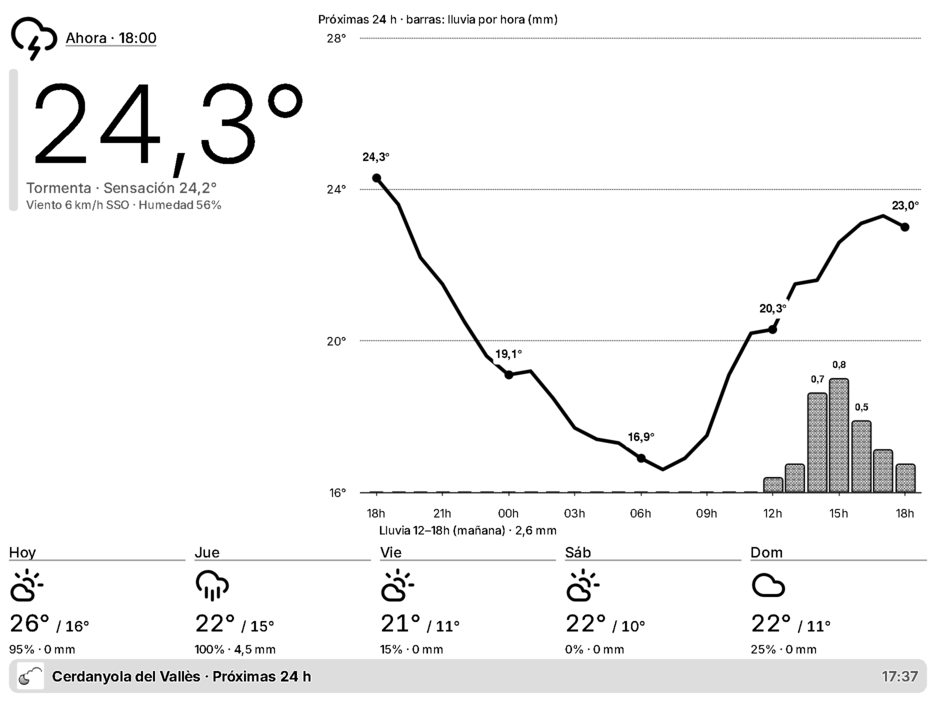
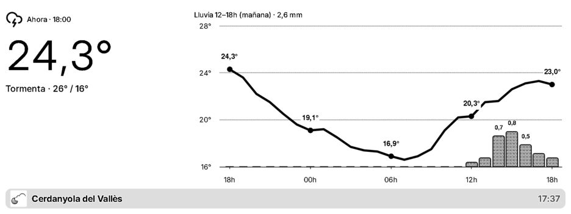
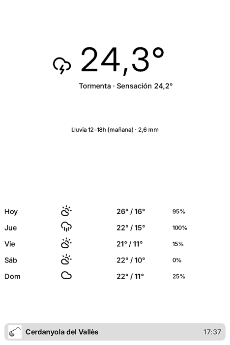
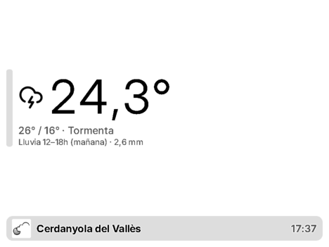

# Cerdanyola Forecast · plugin para TRMNL

**Castellano** · [Català](README.md)

Plugin privado para [TRMNL](https://usetrmnl.com) (pantalla e-ink) que muestra la **previsión del tiempo** en Cerdanyola del Vallès (Barcelona), a partir de los datos abiertos de [meteo.dob-world.com](https://meteo.dob-world.com).

Proyecto personal y no oficial. Complementa el plugin del tiempo en directo [meteocerdanyola-trmnl-dashboard](https://github.com/mikim83/meteocerdanyola-trmnl-dashboard).

## Capturas



| Media pantalla horizontal | Media pantalla vertical | Cuarto de pantalla |
|---|---|---|
|  |  |  |

Capturas renderizadas en un navegador (TRMNX, escala de grises): la pantalla normal es de 1 bit (blanco y negro).

## Qué muestra

- **Ahora**: icono del cielo, temperatura, sensación térmica, viento y humedad de la hora en curso.
- **Gráfico de las próximas 24 h** con la temperatura hora a hora y **barras con la lluvia de cada hora**.
- **Tramo de lluvia previsto** (horas y mm) o «Sin lluvia prevista».
- **Próximos 5 días**: icono, máxima, mínima, probabilidad de lluvia y mm.

Incluye las cuatro vistas de TRMNL: pantalla completa, media horizontal, media vertical y cuarto de pantalla.

## Ajustes del plugin

| Campo | Valores | Por defecto |
|---|---|---|
| **Idioma** (`language`) | Català (`ca`), Castellano (`es`), English (`en`) | `ca` |

El idioma cambia los textos, el separador decimal (coma en catalán y castellano, punto en inglés) y las letras de la rosa de los vientos (O/W).

## Cómo funciona

1. TRMNL consulta [`forecast.json`](https://meteo.dob-world.com/forecast.json), sin clave ni registro. Se regenera cada 30 minutos combinando AEMET (cielo, probabilidad de lluvia, máximas y mínimas), Météo-France AROME, ECMWF IFS y DWD ICON (cantidad de lluvia) y Open-Meteo (el resto). La estructura está descrita en [llms.txt](https://meteo.dob-world.com/llms.txt).
2. [`src/transform.js`](src/transform.js) reduce el fichero (unos 62 KB) a unos 2,5 KB: descarta las horas ya pasadas, calcula los tramos de lluvia y da a cada cielo el número de icono.
3. Las plantillas Liquid traducen los textos, eligen el icono y dibujan el gráfico con Highcharts.

Los valores que no existen se muestran vacíos; nunca se interpretan como cero.

## Estructura del repositorio

```
src/
├── settings.yml            # URL de consulta y campos del plugin (idioma)
├── transform.js            # reduce y calcula los datos
├── shared.liquid           # traducciones, iconos y función del gráfico
├── full.liquid             # pantalla completa
├── half_horizontal.liquid  # media pantalla horizontal
├── half_vertical.liquid    # media pantalla vertical
└── quadrant.liquid         # cuarto de pantalla
assets/icon-512.png         # icono del plugin
docs/screenshots/           # capturas del README
```

## Instalación

Crea un plugin privado en TRMNL (*Plugins → Private Plugin*) y copia el contenido de `src/`:

1. **Estrategia**: Polling (GET), con la `polling_url` de `src/settings.yml`.
2. **Form fields**: pega el bloque `custom_fields` de `src/settings.yml`.
3. **Transform**: pega `src/transform.js`.
4. **Markup**: pega cada `.liquid` en su pestaña (*Shared*, *Full*, *Half horizontal*, *Half vertical*, *Quadrant*).
5. **Framework CSS version**: `3.4.0`.
6. Guarda y elige el idioma en los ajustes del plugin.

## Datos

Los datos son de [meteo.dob-world.com](https://meteo.dob-world.com), una estación aficionada, y la previsión combina fuentes oficiales (AEMET) y modelos numéricos. Es orientativa y no sustituye los avisos oficiales de Meteocat y AEMET.
