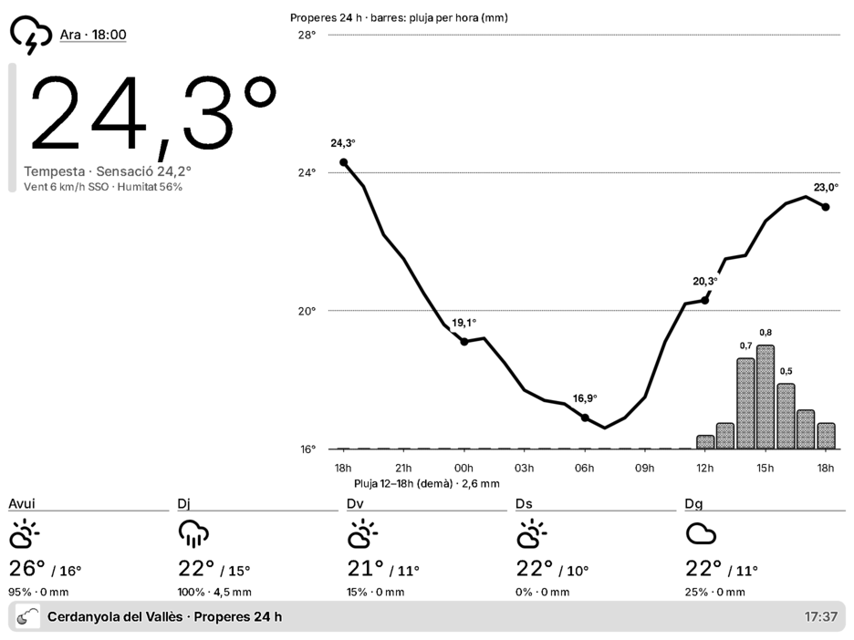
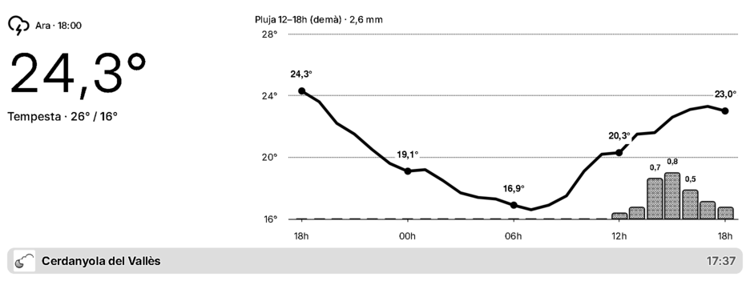
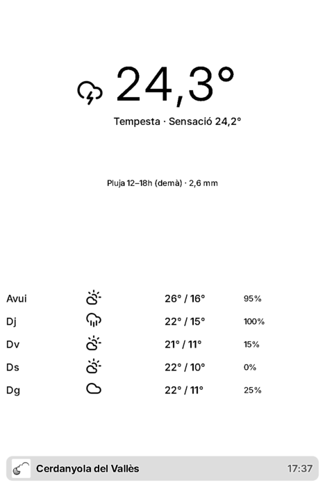
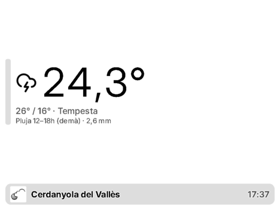

# Cerdanyola Forecast · plugin per a TRMNL

[Castellano](README.es.md) · **Català**

Plugin privat per a [TRMNL](https://usetrmnl.com) (pantalla e-ink) que mostra la **previsió del temps** a Cerdanyola del Vallès (Barcelona), a partir de les dades obertes de [meteo.dob-world.com](https://meteo.dob-world.com).

Projecte personal i no oficial. Complementa el plugin del temps en directe [meteocerdanyola-trmnl-dashboard](https://github.com/mikim83/meteocerdanyola-trmnl-dashboard).

## Captures



| Mitja pantalla horitzontal | Mitja pantalla vertical | Quart de pantalla |
|---|---|---|
|  |  |  |

Captures renderitzades en un navegador (TRMNX, escala de grisos): la pantalla normal és d'1 bit (blanc i negre).

## Què mostra

- **Ara**: icona del cel, temperatura, sensació tèrmica, vent i humitat de l'hora en curs.
- **Gràfic de les properes 24 h** amb la temperatura hora a hora i **barres amb la pluja de cada hora**.
- **Tram de pluja previst** (hores i mm) o «Sense pluja previsible».
- **Propers 5 dies**: icona, màxima, mínima, probabilitat de pluja i mm.

Inclou les quatre vistes de TRMNL: pantalla completa, mitja horitzontal, mitja vertical i quart de pantalla.

## Ajustos del plugin

| Camp | Valors | Per defecte |
|---|---|---|
| **Idioma** (`language`) | Català (`ca`), Castellano (`es`), English (`en`) | `ca` |

L'idioma canvia els textos, el separador decimal (coma en català i castellà, punt en anglès) i les lletres de la rosa dels vents (O/W).

## Com funciona

1. TRMNL consulta [`forecast.json`](https://meteo.dob-world.com/forecast.json), sense clau ni registre. Es regenera cada 30 minuts combinant AEMET (cel, probabilitat de pluja, màximes i mínimes), Météo-France AROME, ECMWF IFS i DWD ICON (quantitat de pluja) i Open-Meteo (la resta). L'estructura està descrita a [llms.txt](https://meteo.dob-world.com/llms.txt).
2. [`src/transform.js`](src/transform.js) redueix el fitxer (uns 62 KB) a uns 2,5 KB: descarta les hores ja passades, calcula els trams de pluja i dóna a cada cel el número d'icona.
3. Les plantilles Liquid tradueixen els textos, trien la icona i dibuixen el gràfic amb Highcharts.

Els valors que no existeixen es mostren buits; mai s'interpreten com a zero.

## Estructura del repositori

```
src/
├── settings.yml            # URL de consulta i camps del plugin (idioma)
├── transform.js            # redueix i calcula les dades
├── shared.liquid           # traduccions, icones i funció del gràfic
├── full.liquid             # pantalla completa
├── half_horizontal.liquid  # mitja pantalla horitzontal
├── half_vertical.liquid    # mitja pantalla vertical
└── quadrant.liquid         # quart de pantalla
assets/icon-512.png         # icona del plugin
docs/screenshots/           # captures del README
```

## Instal·lació

Crea un plugin privat a TRMNL (*Plugins → Private Plugin*) i copia el contingut de `src/`:

1. **Estratègia**: Polling (GET), amb la `polling_url` de `src/settings.yml`.
2. **Form fields**: enganxa el bloc `custom_fields` de `src/settings.yml`.
3. **Transform**: enganxa `src/transform.js`.
4. **Markup**: enganxa cada `.liquid` a la seva pestanya (*Shared*, *Full*, *Half horizontal*, *Half vertical*, *Quadrant*).
5. **Framework CSS version**: `3.4.0`.
6. Desa i tria l'idioma als ajustos del plugin.

## Dades

Les dades són de [meteo.dob-world.com](https://meteo.dob-world.com), una estació aficionada, i la previsió combina fonts oficials (AEMET) i models numèrics. És orientativa i no substitueix els avisos oficials de Meteocat i AEMET.
